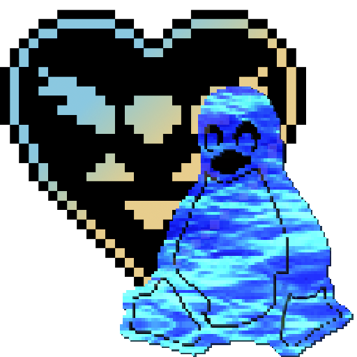

# deltaport
[^1]

> [!NOTE]
> This project is NOT affiliated with nor endorsed by Toby Fox, Fangamer, YoYo Games Ltd or Opera Norway AS.

An unofficial (attempt) of porting DELTARUNE[^2] to Linux

This was originally made as a learning project for personal use, the game works perfectly fine under Proton and you should probably be using that instead.

This doesn't include any game data, you will need to own a copy of the game.

## Usage
> [!IMPORTANT]
> Currently you need version **1.05** or **1.04** to use this script!
 
Download the latest release, and double-click `port.sh` or run in your terminal:

```shell
pug@puter ~>  ./port.sh
```
Follow the instructions on the screen and then launch the game through Steam or run `DELTARUNE.sh` in the game directory.

This project was tested on Ubuntu 26.04 and Arch Linux.

Flatpak Steam and immutable distros are not supported.

## Other versions 

If you're reading this in the future, you may find yourself having a different current version than the one supported here, in that case, here's how you can download a specific version of the game to able to use the port.

Open your terminal program, and type `steam -console`, it should look like this:
```shell
pug@puter ~> steam -console
```
After opening, click the Console tab:


Now, go to [here](https://steamdb.info/depot/1671212/manifests/) on SteamDB, you should find a list of manifests (versions) sorted by upload date, choose the one that applies


Make sure the copy format is: `Steam console` and click copy.

Back on Steam, type `download_depot` and paste what you copied, it should look like this:


After this, hit enter, it should start downloading the depot.


You may notice that at the end of the path `\steamapps\content\app_1671210\depot_1671212` Steam puts `\` there for some reason, just change it to `/` and open it in your file browser of choice, you should have a copy of the game, run `port.sh` and select this directory and you're good to go!

If you want to open the game through Steam, just move the directory to `steamapps/common/DELTARUNE` so that Steam uses it.

## How it works 


As GameMaker: Studio exports game code as bytecode instead of native code, we're able to run the game in any platform as long as we have a compatible runner (The GMS runner)

The porting script renames/moves the game assets to the structure that is expected for the Linux platform.

Even though that works, we still have a problem, DELTARUNE is divided in Chapters and each of them have their own game folder and their own game data

Internally, the game switches between them using a special function called `game_change()` that is unsupported on Linux.

As a workaround, the game's code was patched so that when Chapters are switched, an empty file indicating the switch is created on DELTARUNE's save directory

It looks like this: `~/.config/DELTARUNE/deltaport_chapter# <- Chapter number`
This trigger file is then read by the `DELTARUNE.sh` script which launches the chapter, replicating `game_change`

The goal here is for it to work almost exactly like the Windows version.

## Dependencies 

A `deps.sh` file is already included in the repo and is used by the the `port.sh` script.

It should automatically install all the necessary dependencies for you, unless you're on some niche distro

That being said, it is required to have:
* `hpatchz` - From [HDiffPatch](https://github.com/sisong/HDiffPatch), this is used for patching the game (older versions used xdelta3)
* `inotifywait` - Used to listen for trigger files in the save directory, can be found in distros by the name `inotify-tools`
* `ffmpeg4` - Used to play a video on Chapter 3, note that GameMaker 2022 LTS requires specifically FFmpeg4 to work.
* `wget` - Should be pre-installed in almost any distro, used to download some files.

## Known issues 


* When loading a save file, you may notice that your music/audio is gone, to fix this, go to your save directory: `~/.config/DELTARUNE` and open your save file:
1. `filech#_0` - First save slot
2. `filech#_1` - Second save slot
3. `filech#_2` - Third save slot

Go to line **569/570** (333/334 on Chapter 1) and change the `.` to a `,` or vice-versa.

* Controller input may not work

[^1]: The DELTARUNE logo and characters are copyright of Toby Fox, being used under fair use.
[^2]: DELTARUNE is a trademark of Royal Sciences LLC
