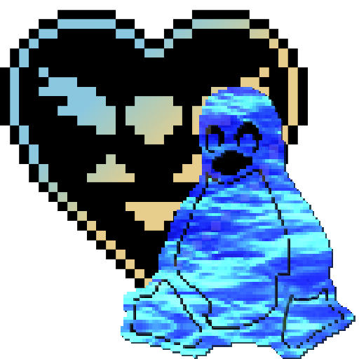

# deltaport
[^1]

> [!NOTE]
> This project is NOT affiliated with nor endorsed by Toby Fox, Fangamer, YoYo Games Ltd or Opera Norway AS.

An unofficial attempt of porting DELTARUNE[^2] to Linux

This was originally made as a learning project for personal use, the game works perfectly fine under Proton and you should probably be using that instead.

This doesn't include any game data, you will need to own a copy of the game.

Flatpak Steam and immutable distros are not supported.

Only available for Linux x86_64

Ei, psiu, fala português? 🇧🇷 **Então veja [a versão PT-BR do deltaport!!](https://github.com/pugdev3/deltaport/tree/pt-br)**

## Usage 
> [!IMPORTANT]
> Check out [Supported versions](https://github.com/pugdev3/deltaport#supported-versions-) for which versions you can use.
 
Download the latest release, and double-click `port.sh` or run in your terminal:

```shell
pug@puter ~>  ./port.sh
```
Follow the instructions on the screen and then launch the game through Steam or run `DELTARUNE.sh` in the game directory.

This project was tested on Ubuntu 26.04 and Arch Linux.

NOTE: If you have issues with keyboard input (like i did), make sure you have flatpak installed and create a file named `.hide_input` in the game's directory, it should hide all `/dev/input` devices from the runner (although no controllers should work)

Also check out the [Console borders mod support](https://github.com/pugdev3/deltaport#console-borders-) if you are interested.

https://github.com/user-attachments/assets/9e50df05-e07f-4e7a-8951-ed42dc3346b4

(small video demo)

## Other versions 

If you're reading this in the future, you may find yourself having a different current version than the one supported here, in that case, here's how you can download a specific version of the game to able to use the port.

Open your terminal program, and type `steam -console`, it should look like this:
```shell
pug@puter ~> steam -console
```
After opening, click the Console tab:


Now, go to [here](https://steamdb.info/depot/1671212/manifests/) on SteamDB, you should find a list of manifests (versions) sorted by upload date, choose the one that applies


Make sure the copy format is: `Steam console` and click copy.

Back on Steam, go ahead and paste what you copied, it should look like this:


After this, hit enter, it should start downloading the depot.


You may notice that at the end of the path `\steamapps\content\app_1671210\depot_1671212` Steam puts `\` there for some reason, just change it to `/` and open it in your file browser of choice, you should have a copy of the game, run `port.sh` and select this directory and you're good to go!

If you want to open the game through Steam, just move the directory to `steamapps/common/DELTARUNE` so that Steam uses it.

## Supported versions 

Here is a list of the currently supported versions by the port:
| Version  | MD5 Checksum  | Launch date | Release/branch |
| -------- | ------------- | ----------- | -------------- |
| [v1.01C and older](https://steamdb.info/patchnotes/18791270/)  | `bdd3fbeb0f51a7b522ca296092a20853` | < 9 June 2025 | [legacy](https://github.com/pugdev3/deltaport/tree/legacy) (branch)
| [v1.04](https://steamdb.info/patchnotes/19477244/) | `9d1fea9de81219ea7304f32f1ae7a878` | 5 August 2025 | [v0.01](https://github.com/pugdev3/deltaport/releases/download/v0.01/deltaport-v0.01.tar.xz)                                                            
| [v1.05 (deltarune105 beta)](https://bsky.app/profile/undertale.com/post/3lxbfrqodwc2l) | `5d3e158dbe6888fbf24471019fbde3c9` | 26 August 2025 | [v0.01](https://github.com/pugdev3/deltaport/releases/download/v0.01/deltaport-v0.01.tar.xz)        
| [v0.0.240 (Chapter 5 release)](https://steamdb.info/patchnotes/23736632/) | `f3dabe6444829688fd7fbaa68f78794f` | 24 June 2026 | [v0.02](https://github.com/pugdev3/deltaport/releases/download/v0.02/deltaport-v0.02.tar.xz)/[v0.03](https://github.com/pugdev3/deltaport/releases/download/v0.03/deltaport-v0.03.tar.gz)          
| [v0.0.241](https://steamdb.info/patchnotes/23909557/) | `0a448a89c32c802a138621a39ced69db` | 25 June 2026 | [v0.02](https://github.com/pugdev3/deltaport/releases/download/v0.02/deltaport-v0.02.tar.xz)/[v0.03](https://github.com/pugdev3/deltaport/releases/download/v0.03/deltaport-v0.03.tar.gz)     
| [v0.0.242](https://steamdb.info/patchnotes/23942272/) | `cc76c5efeb1b5fefd1822ceb1340ca10` | 27 June 2026 | [v0.03](https://github.com/pugdev3/deltaport/releases/download/v0.03/deltaport-v0.03.tar.gz)/[v0.04](https://github.com/pugdev3/deltaport/releases/download/v0.04/deltaport-v0.04.tar.gz)    
| [v0.0.243](https://steamdb.info/patchnotes/23962447/) | `359adb2db26d7e902f4c26b40e9b58ae` | 29 June 2026 | [v0.03](https://github.com/pugdev3/deltaport/releases/download/v0.03/deltaport-v0.03.tar.gz)/[v0.04](https://github.com/pugdev3/deltaport/releases/download/v0.04/deltaport-v0.04.tar.gz)   
| [v0.0.244](https://bsky.app/profile/undertale.com/post/3mpkv5vypm22a) | `ddedbbd10ff129b49c64dbefaa763c6a` | 1 July 2026 | [v0.03](https://github.com/pugdev3/deltaport/releases/download/v0.03/deltaport-v0.03.tar.gz)/[v0.04](https://github.com/pugdev3/deltaport/releases/download/v0.04/deltaport-v0.04.tar.gz)
| [v0.0.247](https://steamdb.info/patchnotes/24122389/) | `908643b7593b000f5b6c61bb484d086a` | 9 July 2026 | [v0.05](https://github.com/pugdev3/deltaport/releases/download/v0.05/deltaport-v0.05.tar.gz)

Other versions can be upgraded using the update script + Steam update

## Console borders 
There is optional support for **[NXRUNE](https://gamejolt.com/games/nxrune/629072)**'s borders mod on deltaport that enables console borders (cool dynamic borders around the screen exclusive to consoles) on Linux, especially useful for widescreen users.
To enable it, type `y` when prompted during the script or run `./port.sh nxrune` in your terminal application.

Currently it's only available for versions: 0.0.244/0.0.247


## How it works 

As GameMaker: Studio exports game code as bytecode instead of native code, we're able to run the game in any platform as long as we have a compatible runner (The GMS runner)

The porting script renames/moves the game assets to the structure that is expected for the Linux platform.

Even though that works, we still have a problem, DELTARUNE is divided in Chapters and each of them have their own game folder and their own game data

Internally, the game switches between them using a special function called `game_change()` that is unsupported on Linux.

As a workaround, the game's code was patched so that when Chapters are switched, an empty file indicating the switch is created on DELTARUNE's save directory

It looks like this: `~/.config/DELTARUNE/deltaport_chapter# <- Chapter number`
This trigger file is then read by the `DELTARUNE.sh` script which launches the chapter, replicating `game_change`

The goal here is for it to work almost exactly like the Windows version.

## Dependencies 


A `deps.sh` file is already included in the repo and is used by the the `port.sh` script.

It should automatically install all the necessary dependencies for you, unless you're on some niche distro

That being said, it is required to have:
* `hpatchz` - From [HDiffPatch](https://github.com/sisong/HDiffPatch), this is used for patching the game (older versions used xdelta3)
* `inotifywait` - Used to listen for trigger files in the save directory, can be found in distros by the name `inotify-tools`
* `ffmpeg4` - Used to play videos on Chapter 3/5, note that GameMaker 2022 LTS requires specifically FFmpeg4 to work.
* `ffmpeg` - Needed to fix video playback in Chapter 5
* `wget` - Should be pre-installed in almost any distro, used to download some files.
* `git` - Used on Arch *btw* to install the AUR package for hdiffpatch

## Known issues 

* If you have a older version of deltaport and your music/audio is gone, go to your save directory: `~/.config/DELTARUNE` and change line **569/570** from a "," to a "."

* Controller input may not work

* An annoying dog may appear during gameplay

## Credits 

[Toby Fox](https://twitter.com/tobyfox) - Creator of this awesome game

[UndertaleModTool](https://github.com/UnderminersTeam/UndertaleModTool) - The goats who created this amazing tool that made this port possible.

[Flibitijibibo](https://flibitijibibo.com/) - This guy with the name I can't pronounce that provided the FFmpeg4 libs for initial video playback support

[Iruzz](https://github.com/IruzzArcana) - For the borders mod used in this port

(Other people I may have forgot to put here)

[^1]: The DELTARUNE logo and characters are copyright of Toby Fox, being used under fair use.
[^2]: DELTARUNE is a trademark of Royal Sciences LLC
